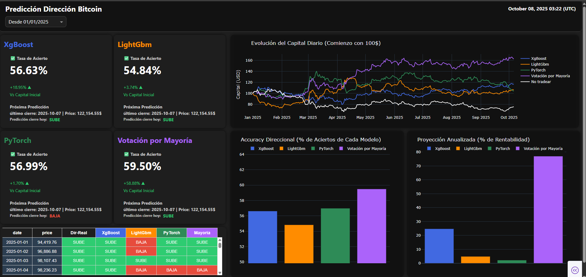

# Predicción de la Dirección Diaria de Bitcoin 📈



Este proyecto presenta un enfoque práctico y reproducible para evaluar modelos de machine learning en la predicción de la dirección diaria del precio de Bitcoin. Diseñado como parte de mi portafolio como aspirante a científico de datos, combina automatización, trazabilidad y visualización interactiva para mostrar el rendimiento real de modelos entrenados exclusivamente con datos históricos.

## 🚀 Objetivo del Proyecto

Predecir si el precio de Bitcoin subirá o bajará al día siguiente, utilizando modelos entrenados con datos financieros desde el 01-01-2015 hasta el 31-12-2024. A partir del 01-01-2025, los modelos se enfrentan a datos completamente nuevos, actualizados automáticamente cada día, lo que permite evaluar su capacidad de generalización en tiempo real.

## 🧠 Modelos Utilizados

Los algoritmos seleccionados para este estudio fueron:

- `XGBoost`
- `LightGBM`
- `PyTorch`

La métrica principal para evaluar su desempeño es el **Direction Accuracy**, que mide cuántas veces el modelo acierta la dirección del movimiento (subida o bajada) del precio de Bitcoin.

> ⚠️ Importante: Un mayor porcentaje de aciertos no garantiza mayor rentabilidad. Un modelo puede acertar en días de baja volatilidad y fallar en días críticos, lo que afecta fuertemente el resultado económico.

## 📊 Dashboard Interactivo

El dashboard fue desarrollado con `Dash` y gráficos de `Plotly`, permitiendo visualizar el comportamiento de los modelos sobre datos nunca antes vistos. Se actualiza automáticamente cada día y muestra:

- Aciertos diarios
- Evolución del capital
- Rentabilidad acumulada
- Comparación entre modelos

## 💰 Backtesting Realista

La rentabilidad se calcula mediante un proceso de backtesting que simula una operación diaria con:

- Capital inicial: **$100**
- Costo de operación: **0.2% por transacción**
- Sin reinversiones intradía

Este enfoque considera comisiones moderadamente altas para reflejar condiciones reales como latencia, spreads y ejecución imperfecta.

### Clase de Evaluación Backtesting

```python
class ModeloBacktesting:
    '''MODELO DE EVALUACION BACKTESTING QUE SE REPITE PARA LOS 4 MODELOS, ENCAPSULADO EN UNA CLASE PARA DISMINUIR CODIGO Y FACILIDAD DE USO'''
    def __init__(self, df: pl.DataFrame, columnas_modelo: list, nombre_modelo: str, transaction_cost_pct: float = 0.002):
        self.df_original = df.select(columnas_modelo)
        self.nombre_modelo = nombre_modelo
        self.transaction_cost_pct = transaction_cost_pct
        self.df_resultado = None
        self.resumen = None

    def evaluar(self, monto_inicial: float = 100):
        df = self.df_original.clone()
        df.columns = ['date', 'price', 'price_tomorrow', 'real_direction', 'prediccion', 'Acierto']

        prices = df['price'].to_list()
        prices_tomorrow = df['price_tomorrow'].to_list()
        aciertos = df['Acierto'].to_list()

        montos = []
        cumulative_return = []
        monto = monto_inicial

        for i in range(len(prices)):
            montos.append(monto)
            costo_operacion = monto * self.transaction_cost_pct
            cambio_porcentual = abs((prices_tomorrow[i] - prices[i]) / prices[i])
            ganancia_perdida = monto * cambio_porcentual
            monto += ganancia_perdida if aciertos[i] == 1 else -ganancia_perdida
            monto -= costo_operacion
            cumulative_return.append(monto - monto_inicial)

        direction_accuracy = sum(aciertos) / len(aciertos)
        ganancia_neta = cumulative_return[-1]
        proyeccion_anualizada = ganancia_neta / len(cumulative_return) * 365

        df = df.with_columns([
            pl.Series('ganancia_neta', cumulative_return, dtype=pl.Float64),
            pl.Series('capital_diario', montos, dtype=pl.Float64)
        ])

        self.df_resultado = df
        self.resumen = {
            "Modelo": self.nombre_modelo,
            "Direction Accuracy": round(direction_accuracy, 4),
            "Ganancia Neta": round(ganancia_neta, 2),
            "Proyección Anualizada": round(proyeccion_anualizada, 2),
            "N_Days": len(cumulative_return)
        }

        return self.df_resultado, self.resumen
```

## 🗂️ Estructura del Proyecto
```bash
├── app.py
├── assets/
├── classes/
├── components/
├── db/
│   └── backup/
├── functions/
├── jupyter/
├── models/
├── requirements.txt
├── app.py
```

## 📦 Requisitos del Proyecto
``` bash
dash==3.2.0
dash-bootstrap-components==2.0.4
joblib==1.5.2
lightgbm==4.6.0
numpy==2.2.6
plotly==6.3.1
polars==1.34.0
requests==2.32.5
scikit-learn==1.7.2
scipy==1.15.3
torch==2.8.0
torchvision==0.23.0
xgboost==3.0.5
```

## 🌐 Proyecto Desplegado

#### 🔗 Ver el Dashboard en línea  
El proyecto está disponible públicamente para su exploración a través del siguiente enlace:

[https://predicciondireccionbitcoin.onrender.com](https://predicciondireccionbitcoin.onrender.com)

> 🛠️ Desplegado en Render (free tier) utilizando inferencia en CPU con modelos previamente entrenados en PyTorch, XGBoost y LightGBM.  
> La instancia puede tardar entre 60 y 120 segundos en activarse si ha estado inactiva.


## 👨‍💻 Autor

#### **Aliskair Rodríguez**  

#### 📧 aliskairraul@gmail.com  
Para consultas, colaboraciones o feedback sobre el proyecto, no dudes en escribirme.

#### 🔗 [LinkedIn](https://www.linkedin.com/in/aliskair-rodriguez-782b3641/)  
Conecta conmigo para explorar más proyectos, compartir ideas o discutir oportunidades en ciencia de datos y desarrollo de soluciones inteligentes.

## Nota:
Este proyecto no constituye asesoría financiera. Es un estudio técnico para evaluar el comportamiento de modelos de machine learning en un entorno altamente volátil como el mercado de criptomonedas.